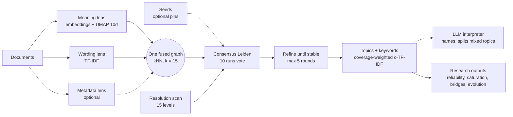

# TriTopic — Visual Brief for an Algorithm Illustration

A brief for designers and image generators: what TriTopic does, step by step, how each step can be drawn,
and which details must be right. Section 7 has ready-to-use prompts.

---

## 1. The idea in one sentence

TriTopic reads a collection of documents through **three lenses** (what they *mean*, which *words* they
use, and optional *metadata*), weaves the documents into **one network**, lets a community-detection
algorithm **vote ten times** on where the groups are, and describes each group (a *topic*) with keywords
that are both frequent and widely shared. Optional layers let you **pin expected topics** (seeds), let an
**LLM read and name** the topics, and produce **research statistics**.

The visual signature is the **"tri"**: three strands of information that converge into one network.

## 2. The pipeline, step by step

| # | Step | What really happens | Visual metaphor | Label (short) |
|---|---|---|---|---|
| 1 | **Documents in** | Raw texts (news, reviews, interviews, papers); each becomes one node later | A loose stack or stream of paper sheets / text cards | *Documents* |
| 2a | **Meaning lens** | A sentence-embedding model turns each document into a vector; UMAP compresses it to 10 dimensions | Sheets pass through a lens and become glowing points in a soft 3-D space; similar meanings land close together | *Meaning* (embeddings) |
| 2b | **Wording lens** | Words are counted once; TF-IDF weights distinctive words | The same sheets pass a second lens: shared words light up as small coloured tokens linking sheets | *Wording* (TF-IDF) |
| 2c | **Metadata lens** (optional) | Source, date, rating, etc. strengthen links between documents that are already similar | Small tags/labels on the sheets; matching tags make existing links slightly thicker. They never create new links | *Metadata* (optional) |
| 3 | **Weave the graph** | Each lens builds a k-nearest-neighbour network (k = 15); the three are fused into one weighted graph. Links found by both meaning and wording get a bonus | Three coloured threads (one per lens) braid into one network of nodes and edges; edges present in two lenses are drawn thicker | *One graph, three views* |
| 4 | **Consensus clustering** | The Leiden algorithm finds communities **10 times**; for each edge, the share of runs that keep both ends together becomes its weight; repeat until the runs agree | Ten translucent "ballot" layers stacked over the network, each with slightly different group outlines; underneath, the agreed groups appear crisp and solid | *10 runs → 1 consensus* |
| 5 | **Choose the granularity** | Automatic mode scans **15 resolutions** and keeps the coarsest partition whose keywords are almost as coherent as the best | A zoom dial or a ladder of the same network at different zoom levels (2 groups → 6 → 12); a checkmark at the chosen level | *How many topics?* |
| 6 | **Refine** | Points are pulled slightly toward their group's centre and the graph is re-clustered, until two rounds agree (max. 5 rounds) | Gentle arrows pulling dots toward cluster centres; a circular "repeat until stable" arrow | *Refine until stable* |
| 7 | **Name the topics with keywords** | Coverage-weighted c-TF-IDF: a keyword must be frequent **and** spread across the topic's documents | Each finished group becomes a labelled card with 5–8 keywords; bar under each word shows how many documents contain it | *Topics + keywords* |
| 8a | **Seeds** (optional) | You describe expected topics in one sentence; the best-matching documents are pinned to one group each; everything else can join or form new groups | Map pins on a few nodes holding their group in place, while new unpinned groups appear elsewhere ("emerged") | *Seeds: expected + emergent* |
| 8b | **LLM interpreter** (optional) | An LLM reads keywords and example documents, names each topic, and flags topics that mix two themes; those are split if the graph agrees | A reader/magnifier figure (abstract, not a robot) annotating cards; one card splits into two | *LLM reads & refines* |
| 8c | **Research outputs** | Reliability per topic (refits on 80% samples), saturation curve, bridge documents, group tests, topic births over time, quotes, methods text | A tidy dashboard strip of small charts: stability bars, an S-shaped curve, a network with bridges, a timeline with new dots | *Numbers for the paper* |

### Flow as a diagram

## 3. Composition options

**A — Hero illustration (16:9, website or slide).** Left: a stream of documents. Centre: three coloured
strands (meaning, wording, metadata) braid into one glowing network in which coloured communities appear.
Right: neat topic cards with keywords. Subtle background: ten faint translucent layers behind the network
(the ten votes). Optional small icons along the bottom for seeds, LLM and research outputs.

**B — Vertical infographic (4:5 or A4).** Eight numbered stages top to bottom, one illustration per stage,
connected by a single line that changes from three strands (stages 2–3) to one strand (stages 4–8).

**C — Icon set.** One flat icon per stage (lens, braid, ballot layers, zoom dial, refine loop, keyword
card, pin, reader, chart strip) in the same line style, for slides and the README.

**D — The triangle mark.** An abstract triangle whose three corners are *meaning*, *wording* and
*metadata*, with a network of dots inside; usable as a logo-like emblem.

## 4. Colours and type (SmartVisions palette)

| Role | Hex | Use in the illustration |
|---|---|---|
| Navy (text, outlines) | `#0F2239` | Lines, labels, dark background variant |
| Deep blue | `#1A3A5C` | Network edges, background panels |
| Petrol (main accent) | `#2E86AB` | **Meaning** strand, highlighted network |
| Amber (signal, use sparingly) | `#F59E0B` | **Wording** strand *or* a single highlight (e.g. the chosen resolution, a newly emerged topic) |
| Grey-blue | `#65758B` | **Metadata** strand (dashed, optional), secondary text |
| Light grey | `#F4F7FA` | Light background |
| Night blue | `#070C14` | Dark background variant |

Topic communities may use additional calm hues (blue, orange, green, pink, violet) but keep the three
strands in petrol / amber / grey-blue so the "tri" stays recognisable. Headings: Playfair Display;
labels: Lato.

## 5. Facts that must be right

- Three views: **meaning** (sentence embeddings), **wording** (TF-IDF), **metadata** (optional). Not
  "three algorithms" or "three models".
- Metadata only **reweights** existing links; it never connects unrelated documents.
- **10** consensus runs; **15** resolutions scanned in automatic mode; **k = 15** neighbours; UMAP to
  **10** dimensions; refinement **max. 5** rounds.
- Every document gets a topic (no large "outlier" pile, unlike HDBSCAN-based tools).
- Seeds **pin** documents; they do not force all documents into the seeded topics.
- The LLM is optional and comes **after** clustering; it reads and names, and a split is kept only if the
  graph agrees.

## 6. Avoid

- Robots, brains, glowing "AI" heads, binary code rain.
- Word clouds as the main image (they say nothing about the method).
- Invented formulas or fake equations; illegible micro-text pretending to be code.
- Showing the LLM as the core of the algorithm; the core is the graph and the consensus vote.
- More than ~12 words of text in the image; keep labels to the short labels in section 2.

## 7. Ready-to-use prompts

**Hero (16:9):**
> Clean editorial vector illustration, light background #F4F7FA. On the left a gentle stream of paper
> sheets flows to the right. It splits into three coloured strands: petrol blue (#2E86AB) labelled
> "Meaning", amber (#F59E0B) labelled "Wording", and a dashed grey-blue strand (#65758B) labelled
> "Metadata". The strands braid into one network of small nodes and thin navy edges in the centre, where
> five softly coloured communities form; behind the network, ten faint translucent layers suggest repeated
> votes. On the right, five neat cards with short keyword lists. Flat design, generous whitespace, precise
> thin lines, no robots, no brains, no code. Small caption "TriTopic".

**Vertical infographic (4:5):**
> Minimal infographic in eight numbered steps, top to bottom, navy text on white, accents petrol blue and
> amber. 1 Documents (stack of sheets) · 2 Three lenses: meaning, wording, metadata · 3 One graph (three
> threads braid into a network) · 4 Ten runs vote (stacked translucent layers) · 5 How many topics? (zoom
> dial) · 6 Refine until stable (loop arrow) · 7 Topics + keywords (cards) · 8 Optional: seeds (pins), LLM
> reads (magnifier), research numbers (small charts). One connecting line changes from three strands to
> one. Flat vector style, Playfair Display headings, Lato labels.

**Emblem:**
> Abstract emblem: an equilateral triangle in thin navy line; its three corners glow in petrol blue,
> amber and grey-blue; inside, a small network of 20 nodes forms three coloured clusters. Flat, minimal,
> works on light and dark backgrounds.
